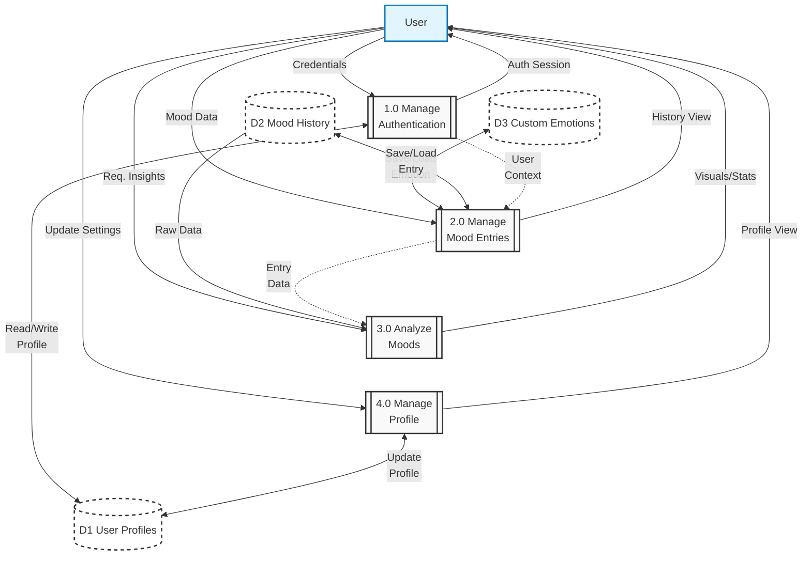

# Data Flow Diagram (DFD) Level 1 - Mood Tracker App

## 1. Diagram

## 2. Components Description

### External Entities

- **User**: The individual interacting with the application.

### Processes

- **1.0 Manage Authentication**: Handles registration, login, and session validation.
- **2.0 Manage Mood Entries**: Handles creation, reading, updating, and deleting of mood logs and custom emotions.
- **3.0 Analyze Moods**: Generates insights and statistics from mood history.
- **4.0 Manage Profile**: Handles user settings and profile updates.

### Data Stores

- **D1 User Profiles**: Stores user identity and preferences (Right side).
- **D2 Mood History**: Stores mood logs (Left side).
- **D3 Custom Emotions**: Stores custom emotion tags (Left side).
