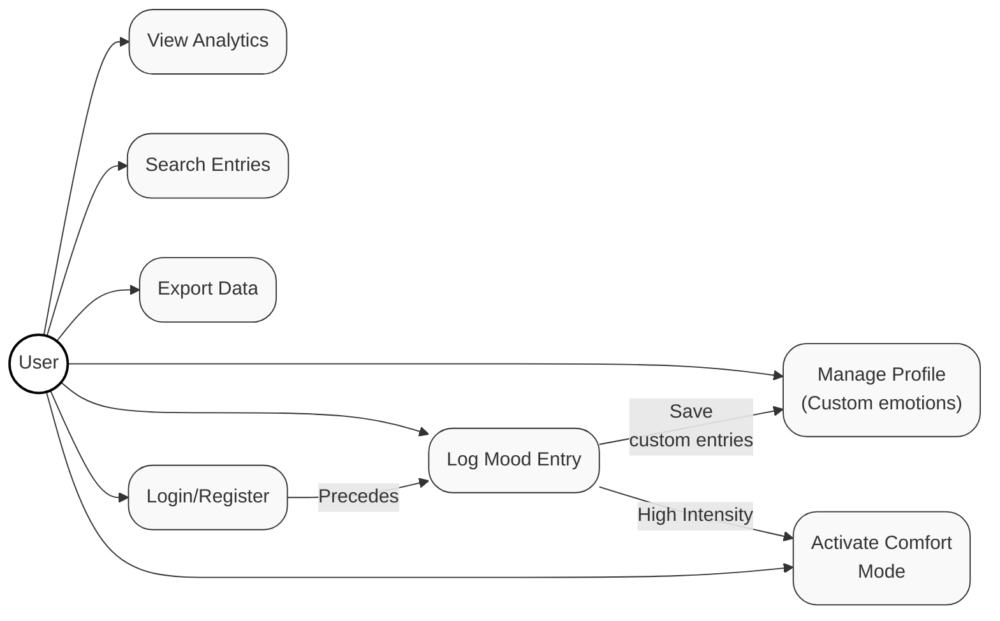

# Use Case Model - Mood Tracker App

## 1. Actors

- **User**: The primary actor who interacts with the application.

## 2. Use Case Diagram

## 3. Use Case Specifications

### Primary Flow: Log Mood Entry

- **Precedes**: User must be authenticated (`Login/Register`).
- **Triggers**: If intensity is high (>2) and mood is negative, it triggers `Activate Comfort Mode`.
- **Updates**: Saving a new custom emotion during logging updates the `Manage Profile` library.
